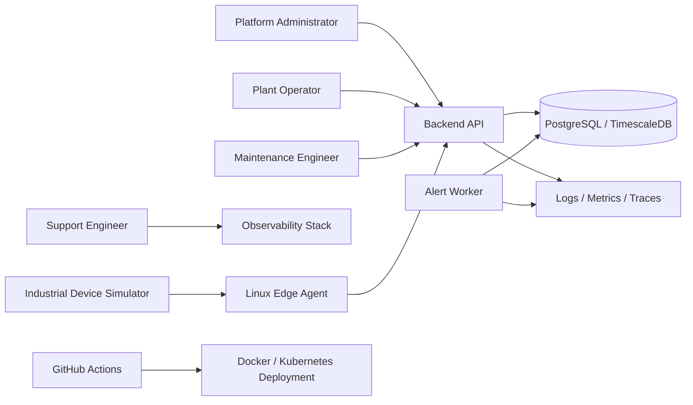
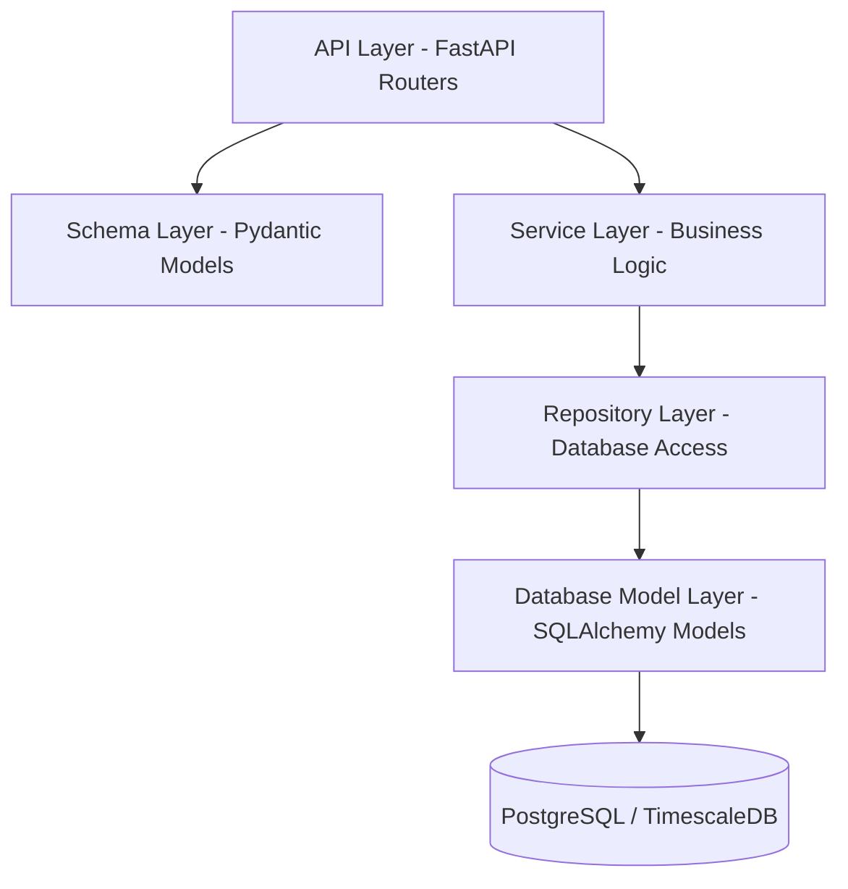
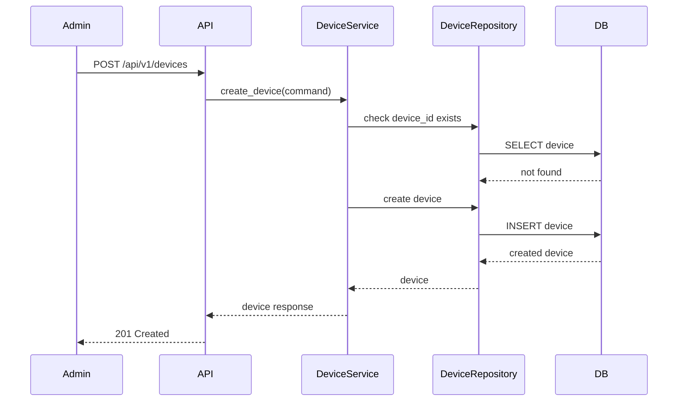
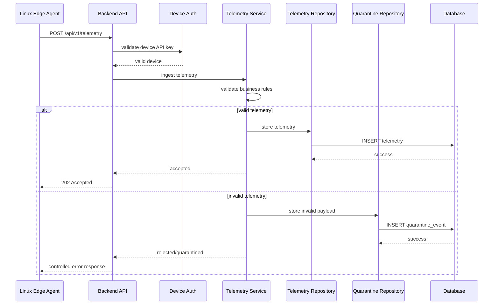
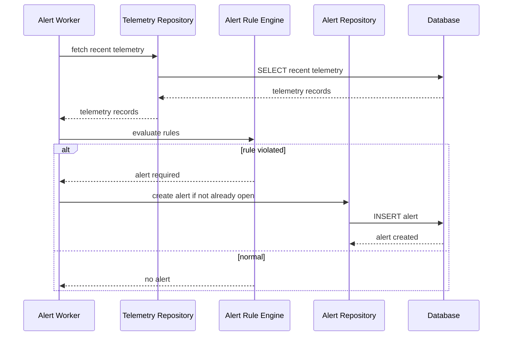
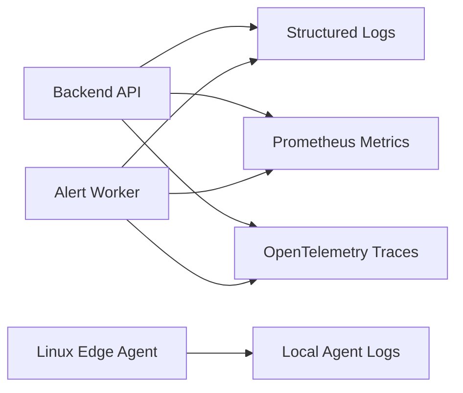
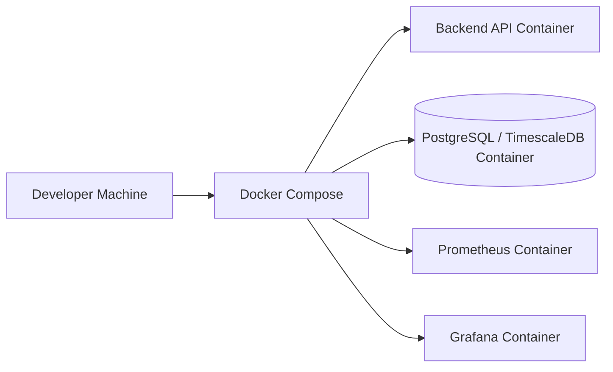
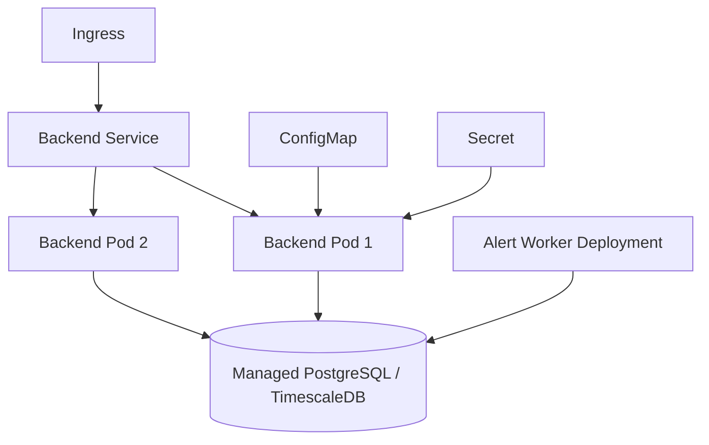

# High-Level Architecture

## Project Name

Industrial Edge Monitoring Platform

## 1. Purpose

This document describes the high-level architecture of the Industrial Edge Monitoring Platform.

It explains the main system components, responsibilities, data flow, security boundaries, runtime behavior, and failure-handling approach.

The goal is to design the system as an enterprise-grade, production-ready backend platform.

---

## 2. Architecture Goals

The architecture should support:

* secure device onboarding
* telemetry ingestion from industrial devices
* Linux-based edge agent integration
* validation and quarantine of bad telemetry
* time-series storage
* alert generation
* alert lifecycle management
* observability
* automated testing
* CI/CD
* Docker-based local development
* Kubernetes-ready deployment
* future AI-based predictive maintenance

---

## 3. System Context

The platform interacts with the following external actors and systems:

```text
Plant Operator
Maintenance Engineer
Platform Administrator
Support Engineer
Linux Edge Agent
Industrial Device / Sensor Simulator
Backend API
Database
Observability Stack
CI/CD Platform
```

High-level context:



---

## 4. Main Containers

The platform is divided into the following major containers.

### 4.1 Backend API Service

Technology:

* Python
* FastAPI
* Pydantic
* SQLAlchemy
* Alembic

Responsibilities:

* expose REST APIs
* authenticate users
* authenticate devices
* validate incoming requests
* manage devices
* receive telemetry
* expose alert APIs
* expose health endpoints
* emit logs, metrics, and traces

---

### 4.2 Linux Edge Agent

Technology:

* Python
* Linux
* systemd
* YAML / environment configuration

Responsibilities:

* simulate industrial sensor data
* send telemetry to backend API
* use device API key
* retry failed events
* buffer events locally when backend is unavailable
* run as a Linux service
* write local operational logs

---

### 4.3 Database

Technology:

* PostgreSQL
* TimescaleDB extension

Responsibilities:

* store device metadata
* store time-series telemetry
* store quarantine events
* store alerts
* store alert rules
* store users and roles
* store audit logs

---

### 4.4 Alert Worker

Technology:

* Python background worker

Responsibilities:

* evaluate telemetry against alert rules
* create alerts
* avoid duplicate open alerts
* update alert lifecycle
* run separately from API where possible

---

### 4.5 Observability Stack

Technology:

* structured JSON logs
* Prometheus
* Grafana
* OpenTelemetry

Responsibilities:

* collect logs
* collect metrics
* collect traces
* support debugging
* support production troubleshooting
* support dashboarding

---

### 4.6 CI/CD Platform

Technology:

* GitHub Actions

Responsibilities:

* run formatting checks
* run linting
* run type checks
* run unit tests
* run integration tests
* run security scans
* build Docker images
* support deployment automation

---

## 5. Backend Logical Architecture

The backend follows layered architecture.



Layer responsibilities:

| Layer            | Responsibility                                        |
| ---------------- | ----------------------------------------------------- |
| API Layer        | HTTP routing, request/response handling, status codes |
| Schema Layer     | Request and response validation                       |
| Service Layer    | Business rules and orchestration                      |
| Repository Layer | Database queries and persistence                      |
| Model Layer      | ORM table definitions and relationships               |

Rules:

* API routes must not contain business logic.
* API routes must not directly query the database.
* Services should contain business decisions.
* Repositories should contain database operations.
* Schemas should define external API contracts.

---

## 6. Runtime Data Flow

### 6.1 Device Registration Flow



---

### 6.2 Telemetry Ingestion Flow



---

### 6.3 Alert Processing Flow



---

## 7. Security Architecture

The platform has two authentication flows.

### 7.1 User Authentication

Used by:

* administrators
* operators
* viewers
* support engineers

Approach:

* JWT-based authentication
* role-based authorization
* protected API endpoints

Roles:

| Role     | Permissions                           |
| -------- | ------------------------------------- |
| ADMIN    | Manage devices, users, alert rules    |
| OPERATOR | Acknowledge and resolve alerts        |
| VIEWER   | Read-only access                      |
| SUPPORT  | View logs, health, quarantine records |

---

### 7.2 Device Authentication

Used by:

* Linux edge agents
* simulated industrial devices

Approach:

* device API key
* API key linked to device_id
* disabled devices cannot send telemetry
* invalid device key returns 401

Security rules:

* API keys must not be logged.
* Secrets must not be committed.
* Production communication should use HTTPS.
* Sensitive headers should be masked in logs.

---

## 8. Failure Handling

The system should handle failures in a controlled way.

| Failure Scenario                | Expected Behavior                          |
| ------------------------------- | ------------------------------------------ |
| Backend unavailable             | Edge agent buffers telemetry locally       |
| Database unavailable            | API returns controlled 503 or 500 response |
| Invalid telemetry               | Event goes to quarantine                   |
| Duplicate telemetry             | event_id prevents duplicate insert         |
| Alert worker fails              | Telemetry ingestion continues              |
| Device sends bad API key        | API returns 401                            |
| Disabled device sends telemetry | API rejects request                        |
| Unexpected exception            | Error is logged with correlation_id        |

---

## 9. Observability Architecture

The platform will use:

* structured logging
* correlation ID
* metrics
* tracing
* health endpoints

Important endpoints:

```text
/health
/live
/ready
/metrics
```

Observability flow:



Every request should have:

```text
correlation_id
timestamp
service_name
request_path
response_status
duration_ms
```

---

## 10. Deployment Architecture

### 10.1 Local Development

Local environment will use Docker Compose.

Components:

* backend API
* PostgreSQL / TimescaleDB
* optional Prometheus
* optional Grafana



---

### 10.2 Kubernetes Deployment

Future deployment will use Kubernetes.

Components:

* backend deployment
* alert worker deployment
* service
* config map
* secret
* ingress
* liveness probe
* readiness probe
* horizontal pod autoscaler



---

## 11. Data Storage Overview

Main data groups:

| Data Group            | Storage                |
| --------------------- | ---------------------- |
| Device metadata       | PostgreSQL             |
| Telemetry time-series | TimescaleDB hypertable |
| Quarantine events     | PostgreSQL JSONB       |
| Alerts                | PostgreSQL             |
| Alert rules           | PostgreSQL             |
| Users and roles       | PostgreSQL             |
| Audit logs            | PostgreSQL             |

---

## 12. Key Architecture Decisions

| Decision                         | ADR     |
| -------------------------------- | ------- |
| Use modular monorepo             | ADR-001 |
| Use layered backend architecture | ADR-002 |
| Use FastAPI                      | ADR-003 |
| Use PostgreSQL/TimescaleDB       | ADR-004 |
| Use Docker Compose locally       | ADR-005 |
| Use systemd for edge agent       | ADR-006 |

---

## 13. Traceability to Requirements

| Requirement        | Architecture Support                 |
| ------------------ | ------------------------------------ |
| FR-001 to FR-005   | Device registry service              |
| FR-006 to FR-008   | Telemetry ingestion and quarantine   |
| FR-009 to FR-012   | Alert worker and alert APIs          |
| FR-013 to FR-015   | Linux edge agent                     |
| FR-016 to FR-018   | Authentication and authorization     |
| FR-019 to FR-021   | Health checks, logs, metrics         |
| FR-022             | Audit logging                        |
| NFR-004            | Stateless API and Kubernetes scaling |
| NFR-008            | event_id idempotency                 |
| NFR-016 to NFR-019 | Observability architecture           |
| NFR-020            | Layered architecture                 |
| NFR-025 to NFR-027 | Docker, Kubernetes, and CI/CD        |

---

## 14. Summary

The Industrial Edge Monitoring Platform is designed as a production-style backend platform with clear separation of responsibilities.

The architecture supports secure telemetry ingestion, Linux edge integration, validation, quarantine, alerting, observability, testing, CI/CD, and future Kubernetes deployment.

This design allows the project to grow from a local development system into a cloud-ready enterprise platform.